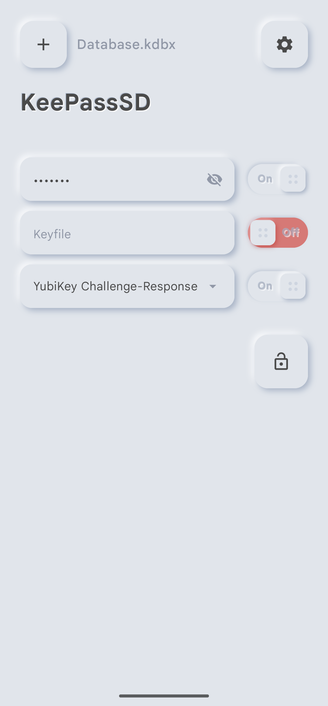
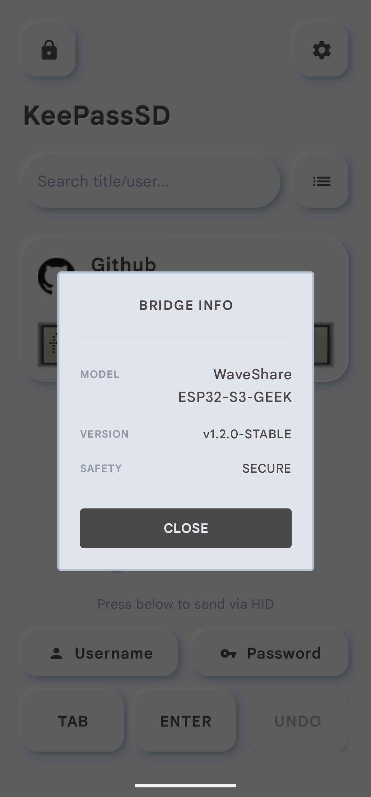
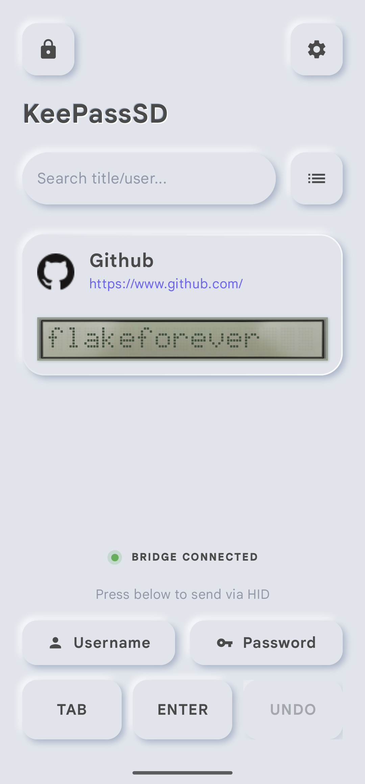
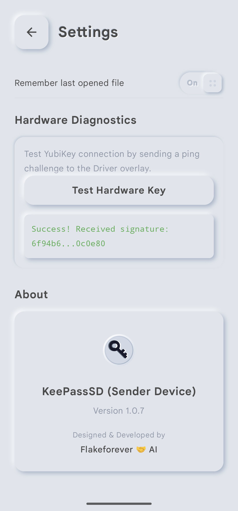

# KeePassSD for Android

**A minimalist, hardware-assisted KeePass reader and credential sender for Android.**

---

## 🤖 100% AI-Programmed
KeePassSD is a unique experiment in software development: **100% of its code was written by an AI agent**, under the technical guidance and supervision of **[Flakeforever](https://github.com/flakeforever)**. This project demonstrates the potential of agentic AI in building functional, security-conscious mobile applications.

## 📱 Screenshots
| Unlock Screen | Device Info | Main Screen | Settings Screen |
| :---: | :---: | :---: | :---: |
|  |  |  |  |

## 📖 What is KeePassSD?
KeePassSD is a "Read-Only" companion for your KeePass (.kdbx) database. It is designed with a specific philosophy: **Minimalism + Physical Security**.

- **Read-Only**: The app *only* reads your database. It cannot modify, delete, or create entries. This ensures the integrity of your master vault.
- **Credential Sender**: Instead of copy-pasting (which is vulnerable to clipboard sniffers), KeePassSD sends your credentials to a remote computer via a physical **USB HID Emulation device**.
- **Bluetooth LE**: The app communicates with the hardware bridge over an encrypted BLE connection.

## 🚀 Key Features
- **Zero-Modification Policy**: Protects your database from accidental corruption.
- **Hardware Bridge**: Emulates a USB keyboard to "type" your passwords into any OS without drivers.
- **YubiKey Integration**: Supports **YubiKey Challenge-Response** (KDBX 3/4) via the [Key Driver by Kunzisoft](https://gitlab.com/kunzisoft/android-hardware-key-driver).
- **Offline First**: Designed to operate in air-gapped or restricted environments.
- **Neumorphic Design**: A premium, modern UI built with custom Jetpack Compose tokens.

## 🛠 Hardware Requirements
To use the "Send" functionality, you need a hardware bridge:
- **MCU**: Any **ESP32-S3** development board (supports native USB HID).
- **Tested Device**: [Waveshare ESP32-S3-GEEK](https://www.waveshare.com/esp32-s3-geek.htm).
- **Firmware**: The device must run our open-source **CircuitPython** bridge script (available in the `/hardware` directory).

## 📥 Getting Started
1. **Maintenance**: Use [KeePassXC](https://keepassxc.org/) or [KeePassDX](https://www.keepassdx.com/) to manage your database.
2. **Setup**:
   - Install the **Kunzisoft Key Driver** if using a YubiKey.
   - Flash your ESP32-S3 with the bridge script.
3. **Usage**:
   - Open your `.kdbx` file in KeePassSD.
   - Pair with "KPB-Bridge" over Bluetooth.
   - Select an entry and tap **Send Password**.

## 🛡 Security Note
KeePassSD is designed for users who prioritize physical security. By hardware-emulating a keyboard, it bypasses the need for shared clipboards or network-based credential sync, making it resilient against software-based keyloggers on the target machine.

---
## 📄 License
This project is licensed under the **Apache License 2.0**. See the [LICENSE](https://github.com/flakeforever/KeePassSD/blob/main/LICENSE) file for details.

*Maintained by [Flakeforever](https://github.com/flakeforever) | Powered by AI*
